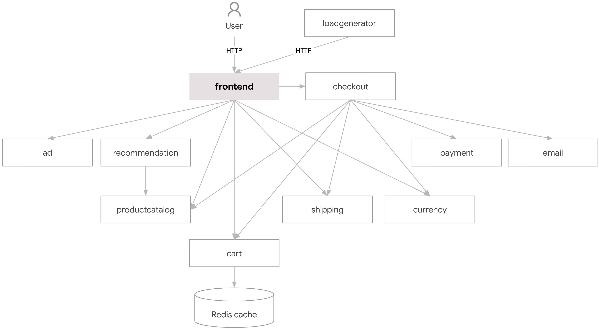
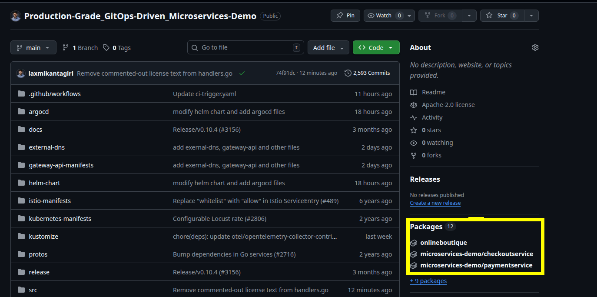
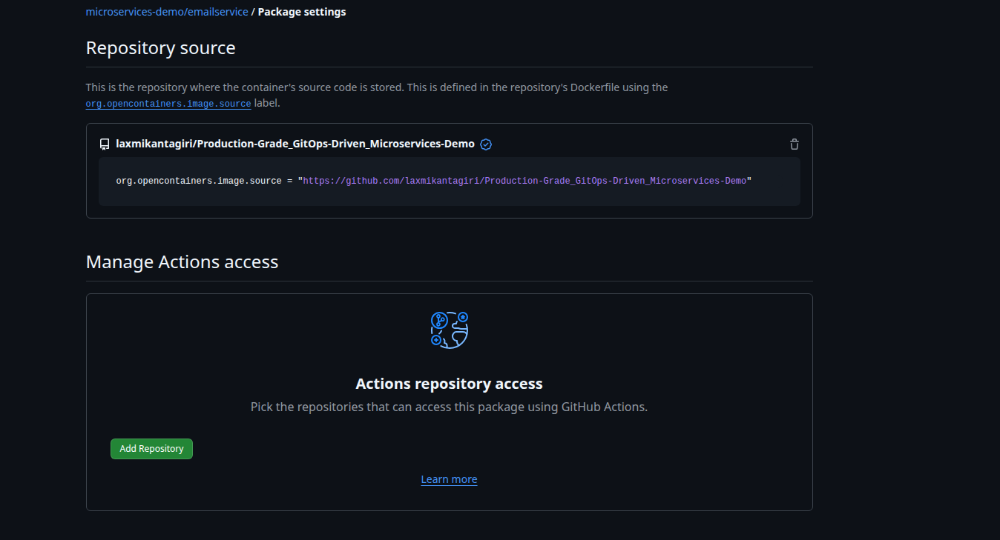

# Project Introduction

# Intro to Online Boutique App

This is a type of e-commerce platform, but unlike Amazon-type stores, it focuses on:

- **Niche or curated products**
- **Unique / limited collections**
- **Strong brand identity & style**

Think of it as a **digital version of a small, stylish fashion store**.

But from a **technical perspective**, modern boutique apps are **not built as a single application**.

They are built using **Microservices Architecture**.

> [!TIP]
># What is Microservices?
>
>**Microservices** is an architectural style where an application is broken into **small, independent services**, and each service:
>
>- Handles a **specific business function**
>- Runs independently
>- Communicates via APIs
>
>👉 Instead of one big application (monolith), you have **multiple small services working together**.
>
>---
>
># Online Boutique = Microservices in Action
>
>This online boutique app is made up of multiple services like:
>
>### 🧾 Product Catalog Service
>
>- Manages product list, categories, pricing
>
>### 🛒 Cart Service
>
>- Handles user cart (add/remove items)
>
>### 💳 Payment Service
>
>- Processes payments (UPI, cards)
>
>### 📦 Order Service
>
>- Manages order lifecycle
>
>### 👤 Frontend Service
>
>- Authentication & profiles
>
>### 🚚 Shipping Service
>
>- Delivery tracking & logistics
>
>### Etc..
>
>---
>
># How These Services Communicate
>
>- REST APIs (HTTP)
>- gRPC (faster internal communication)
>- Message queues (Kafka / RabbitMQ)
>
>👉 Example:
>
>- Cart service → calls Product service
>- Order service → calls Payment service
>
>---
>
># Monolith vs Microservices
>
>### Monolithic App ❌
>
>- Everything in one codebase
>- Hard to scale
>- Single failure affects whole system
>
>### Microservices App ✅
>
>- Independent services
>- Easy to scale
>- Fault isolation
>
>👉 That’s why modern apps (like boutique apps) >use microservices.


# **Architecture**

**Online Boutique** is composed of 11 microservices written in different languages that talk to each other over gRPC.



| **Service** | **Language** | **Description** |
| --- | --- | --- |
| [frontend](https://github.com/laxmikantagiri/Production-Grade_GitOps-Driven_Microservices-Demo/blob/main/src/frontend) | Go | Exposes an HTTP server to serve the website. Does not require signup/login and generates session IDs for all users automatically. |
| [cartservice](https://github.com/laxmikantagiri/Production-Grade_GitOps-Driven_Microservices-Demo/blob/main/src/cartservice) | C# | Stores the items in the user's shopping cart in Redis and retrieves it. |
| [productcatalogservice](https://github.com/laxmikantagiri/Production-Grade_GitOps-Driven_Microservices-Demo/blob/main/src/productcatalogservice) | Go | Provides the list of products from a JSON file and ability to search products and get individual products. |
| [currencyservice](https://github.com/laxmikantagiri/Production-Grade_GitOps-Driven_Microservices-Demo/blob/main/src/currencyservice) | Node.js | Converts one money amount to another currency. Uses real values fetched from European Central Bank. It's the highest QPS service. |
| [paymentservice](https://github.com/laxmikantagiri/Production-Grade_GitOps-Driven_Microservices-Demo/blob/main/src/paymentservice) | Node.js | Charges the given credit card info (mock) with the given amount and returns a transaction ID. |
| [shippingservice](https://github.com/laxmikantagiri/Production-Grade_GitOps-Driven_Microservices-Demo/blob/main/src/shippingservice) | Go | Gives shipping cost estimates based on the shopping cart. Ships items to the given address (mock) |
| [emailservice](https://github.com/laxmikantagiri/Production-Grade_GitOps-Driven_Microservices-Demo/blob/main/src/emailservice) | Python | Sends users an order confirmation email (mock). |
| [checkoutservice](https://github.com/laxmikantagiri/Production-Grade_GitOps-Driven_Microservices-Demo/blob/main/src/checkoutservice) | Go | Retrieves user cart, prepares order and orchestrates the payment, shipping and the email notification. |
| [recommendationservice](https://github.com/laxmikantagiri/Production-Grade_GitOps-Driven_Microservices-Demo/blob/main/src/recommendationservice) | Python | Recommends other products based on what's given in the cart. |
| [adservice](https://github.com/laxmikantagiri/Production-Grade_GitOps-Driven_Microservices-Demo/blob/main/src/adservice) | Java | Provides text ads based on given context words. |
| [loadgenerator](https://github.com/laxmikantagiri/Production-Grade_GitOps-Driven_Microservices-Demo/blob/main/src/loadgenerator) | Python/Locust | Continuously sends requests imitating realistic user shopping flows to the frontend. |

Screenshots:


---

**Most services are stateless**, and **only the cart uses persistence (Redis)**. Let’s break it down cleanly.

# How data works in `microservices-demo`

This project is **designed** to:

- Demonstrate **microservice communication**
- Be **easy to deploy anywhere**
- Avoid complex database ops

So it uses **minimal persistence** on purpose.

---

## Service-by-Service Data Breakdown

### ✅ **cartservice** → ✔️ HAS persistence

**Storage used:**

- **Redis**

**What’s stored:**

- User cart items
- Quantity, product IDs

**Why Redis?**

- Fast
- Simple
- Easy to reset
- No schema complexity

📌 In Kubernetes:

- Redis runs as a pod (or StatefulSet)
- Cart data is lost if Redis is deleted (by default)

---

### ❌ **orders / checkout** → NO real database

There is **NO dedicated “orders database”**.

**checkoutservice:**

- Aggregates data from:
    - cartservice
    - paymentservice
    - shippingservice
    - emailservice
- Simulates order placement
- Does **not persist orders**

👉 This is **by design**, to keep the demo lightweight.

---

### ❌ **productcatalogservice**

**Storage:**

- Static JSON file
- Loaded into memory at startup

**No DB**

- Products reset on restart

---

### ❌ **recommendationservice**

**Storage:**

- Stateless
- Generates recommendations dynamically

---

### ❌ **paymentservice**

**Storage:**

- None
- Fake payment processor

---

### ❌ **shippingservice**

**Storage:**

- None
- Simulated shipping cost logic

---

### ❌ **emailservice**

**Storage:**

- None
- Just logs “email sent”

---

### ❌ **adservice**

**Storage:**

- In-memory ad data
- No persistence

---

### ❌ **frontend**

**Storage:**

- Stateless
- Just UI + API calls

---

### ❌ **currencyservice**

**Storage:**

- Static exchange rates
- In-memory only

---

## SUMMARY TABLE

| Service | Persistent Storage | Type |
| --- | --- | --- |
| cartservice | ✅ Yes | Redis |
| checkoutservice | ❌ No | Stateless |
| productcatalogservice | ❌ No | In-memory JSON |
| recommendationservice | ❌ No | Stateless |
| paymentservice | ❌ No | Fake |
| shippingservice | ❌ No | Fake |
| emailservice | ❌ No | Fake |
| adservice | ❌ No | In-memory |
| frontend | ❌ No | Stateless |
| currencyservice | ❌ No | In-memory |
| loadgenerator | ❌ No | Stateless |

---

> “The demo intentionally keeps most services stateless to simplify deployment and focus on platform concerns like CI/CD, observability, scaling, and networking.”
> 

---

# Project Architecture


---
---
---
---
# Implementation

## Install tools in Local Machine

- AWS CLI
- Terraform in your local machine
- Create an IAM user and create access key and secret access key for the user and do `aws configure`

Clone the repo:

```bash
https://github.com/laxmikantagiri/Production-Grade_GitOps-Driven_Microservices-Demo.git
```

chnage directory to terraform:

```bash
cd Production-Grade_GitOps-Driven_Microservices-Demo/terraform/
```

## Terraform Run

Clone te repo , `cd` to `terraform` directory. Do

```bash
terraform init
Terraform plan 
```

Verify the resources and then do

```bash
terraform apply
```

After apply you should see the bastion host’s public IP as outputs.

At the current directory you would see the instance’s private key as well

## Set up Terraform Remote Backend (Optional)

Create a bucket using Console or AWS CLI.

```bash
aws s3api create-bucket \
  --bucket devopsdock-terraform-backend-bucket \
  --region us-east-1
```

Enable versioning and bucket encryption:

```bash
# Enable versioning
aws s3api put-bucket-versioning \
  --bucket devopsdock-terraform-backend-bucket \
  --versioning-configuration Status=Enabled

# Enable encryption
aws s3api put-bucket-encryption \
  --bucket devopsdock-terraform-backend-bucket \
  --server-side-encryption-configuration '{
    "Rules":[{
      "ApplyServerSideEncryptionByDefault":{
        "SSEAlgorithm":"AES256"
      }
    }]
  }'

```

Add this below backend block in `terraform.tf` file

```bash
terraform {
  backend "s3" {
    bucket = "devopsdock-terraform-backend-bucket"
    key    = "s3-backend"
    region = "us-east-1"
  }
}
```

Run `terraform init` to initialize it again.

As we already have the tfstate file locally you would see something similar , i.e move your state to backend.

Example Output:

```bash
 Initializing the backend...
Do you want to copy existing state to the new backend?
  Pre-existing state was found while migrating the previous "local" backend to the
  newly configured "s3" backend. No existing state was found in the newly
  configured "s3" backend. Do you want to copy this state to the new "s3"
  backend? Enter "yes" to copy and "no" to start with an empty state.

  Enter a value: 
```

Type “Yes”, The backend will move to s3.

Now the state will be reading from s3 backend.

## Bastion Host Configuration

SSH to the Bastion host from the same terraform directory as it creates the private key in the same directory.

```bash
ssh -i bastion-key.pem ubuntu@<publicIP>
```

Now install the below tools  in the Bastion Host:

- AWS CLI
- kubectl client
- HELM
- eksctl

**Installation Resource Docs**

- [https://docs.aws.amazon.com/cli/latest/userguide/getting-started-install.html](https://docs.aws.amazon.com/cli/latest/userguide/getting-started-install.html)
- [https://kubernetes.io/docs/tasks/tools/install-kubectl-linux/#install-using-native-package-management](https://kubernetes.io/docs/tasks/tools/install-kubectl-linux/#install-using-native-package-management)
- [https://helm.sh/docs/intro/install/](https://helm.sh/docs/intro/install/)
- [https://docs.aws.amazon.com/eks/latest/eksctl/installation.html](https://docs.aws.amazon.com/eks/latest/eksctl/installation.html)

Do `aws configure` and set up with the access and secret access keys , You can use the same access and secret access key which you set it up in the local.

Then, import the kubeconfig file by putting the below command.

```bash
aws eks update-kubeconfig --region <your-region> --name <your-cluster-name> 
```

After added the context check:

```bash
kubectl get nodes
```

Expected Output:

```bash
kubectl get nodes
NAME                         STATUS   ROLES    AGE    VERSION
ip-10-0-1-248.ec2.internal   Ready    <none>   100m   v1.33.5-eks-ecaa3a6
ip-10-0-2-138.ec2.internal   Ready    <none>   100m   v1.33.5-eks-ecaa3a6
```

## Install **AWS Load Balancer Controller**

Docs: [https://docs.aws.amazon.com/eks/latest/userguide/lbc-helm.html](https://docs.aws.amazon.com/eks/latest/userguide/lbc-helm.html)

[https://kubernetes-sigs.github.io/aws-load-balancer-controller/latest/deploy/installation/](https://kubernetes-sigs.github.io/aws-load-balancer-controller/latest/deploy/installation/)

Create an IAM OIDC provider. You can skip this step if you already have one for your cluster. In our case this is done at the terraform level.

```bash
eksctl utils associate-iam-oidc-provider \
    --region <region-code> \
    --cluster <your-cluster-name> \
    --approve
```

**Create IAM role using `eksctl`.**

1. Download an IAM policy for the AWS Load Balancer Controller that allows it to make calls to AWS APIs on your behalf.
    
    ```bash
    curl -O https://raw.githubusercontent.com/kubernetes-sigs/aws-load-balancer-controller/v2.14.1/docs/install/iam_policy.json
    ```
    
2. Create an IAM policy using the policy downloaded in the previous step.
    
    ```bash
    aws iam create-policy \
        --policy-name AWSLoadBalancerControllerIAMPolicy \
        --policy-document file://iam_policy.json
    ```
    
3. Replace the values for cluster name, region code, and account ID.
    
    ```bash
    eksctl create iamserviceaccount \
        --cluster=<cluster-name> \
        --namespace=kube-system \
        --name=aws-load-balancer-controller \
        --attach-policy-arn=arn:aws:iam::<AWS_ACCOUNT_ID>:policy/AWSLoadBalancerControllerIAMPolicy \
        --override-existing-serviceaccounts \
        --region <aws-region-code> \
        --approve
    ```
    

**Install AWS Load Balancer Controller**

1. Add the `eks-charts` Helm chart repository. AWS maintains [this repository](https://github.com/aws/eks-charts) on GitHub.
    
    ```bash
    helm repo add eks https://aws.github.io/eks-charts
    ```
    
2. Update your local repo to make sure that you have the most recent charts.
    
    ```bash
    helm repo update eks
    ```
    
3. Install the AWS Load Balancer Controller.
    - `-set region=region-code`
    - `-set vpcId=vpc-xxxxxxxx`
        
        Replace `*my-cluster*` with the name of your cluster. In the following command, `aws-load-balancer-controller` is the Kubernetes service account that you created in a previous step.
        
        ```bash
        helm upgrade -i aws-load-balancer-controller eks/aws-load-balancer-controller \
          -n kube-system \
          --set clusterName=test-terraform-cluster \
          --set region=us-east-1 \
          --set vpcId=vpc-045ed20a9ec483107 \
          --set serviceAccount.create=false \
          --set serviceAccount.name=aws-load-balancer-controller \
          --set controllerConfig.featureGates.NLBGatewayAPI=true \
          --set controllerConfig.featureGates.ALBGatewayAPI=true \
          --version 3.0.0
        ```
        

**Verify that the controller is installed**

1. Verify that the controller is installed.
    
    ```bash
    kubectl get deployment -n kube-system aws-load-balancer-controller
    ```
    
    An example output is as follows.
    
    ```bash
    NAME                           READY   UP-TO-DATE   AVAILABLE   AGE
    aws-load-balancer-controller   2/2     2            2           84s
    ```
    

## Gateway API

Docs: [https://kubernetes-sigs.github.io/aws-load-balancer-controller/latest/guide/gateway/l7gateway/](https://kubernetes-sigs.github.io/aws-load-balancer-controller/latest/guide/gateway/l7gateway/)

Installation of Gateway API CRDs

- Standard Gateway API CRDs:  [REQUIRED]
    
    ```bash
    kubectl apply -f https://github.com/kubernetes-sigs/gateway-api/releases/download/v1.3.0/standard-install.yaml
    ```
    
- Experimental Gateway API CRDs:  [OPTIONAL: Used for L4 Routes]
    
    ```bash
    kubectl apply -f https://github.com/kubernetes-sigs/gateway-api/releases/download/v1.3.0/experimental-install.yaml
    ```
    
- Installation of LBC Gateway API specific CRDs:
    
    ```bash
    kubectl apply -f https://raw.githubusercontent.com/kubernetes-sigs/aws-load-balancer-controller/refs/heads/main/config/crd/gateway/gateway-crds.yaml
    ```
    

> [!NOTE]
>
>All the configs are already availbale in their respective directories, We can use them or copy from this guide and configure on your own.

Create a gateway class:

`gateway-class.yaml`

```bash
# alb-gatewayclass.yaml
apiVersion: gateway.networking.k8s.io/v1beta1
kind: GatewayClass
metadata:
  name: aws-alb-gateway-class
spec:
  controllerName: gateway.k8s.aws/alb
```

apply the manifest:

```bash
kubectl apply -f gateway-class.yaml
```

Create the Load balancer configuration:

This is required for AWS LBC controller and might not be required for othe rgateway api controller.

`alb-config.yaml`

```bash
# lbconfig.yaml
apiVersion: gateway.k8s.aws/v1beta1
kind: LoadBalancerConfiguration
metadata:
  name: app-gw-lbconfig
  namespace: default
spec:
  scheme: internet-facing
  listenerConfigurations:
    - protocolPort: HTTPS:443
      defaultCertificate: <certificate arn>
```

Apply :

```bash
kubectl apply -f alb-config.yaml
```

**Create the gateway:**

`gateway.yaml`

```bash
# my-alb-gateway.yaml
apiVersion: gateway.networking.k8s.io/v1beta1
kind: Gateway
metadata:
  name: app-alb-gateway
  namespace: default
spec:
  gatewayClassName: aws-alb-gateway-class
  infrastructure:
    parametersRef:
      kind: LoadBalancerConfiguration
      name: app-gw-lbconfig
      group: gateway.k8s.aws
  listeners:
  - name: http
    protocol: HTTP
    port: 80
    hostname: "*.devopsdock.site"
    allowedRoutes:
      namespaces:
        from: All
  - name: https
    protocol: HTTPS
    hostname: "*.devopsdock.site"
    port: 443
    allowedRoutes:
      namespaces:
        from: All
```

Apply Gateway manifests:

```bash
kubectl apply -f gateway.yaml
```

Verify the gateway and the load balancer in the AWS UI.

```bash
kubectl get gateway

NAME              CLASS                   ADDRESS                                                                  PROGRAMMED   AGE
app-alb-gateway   aws-alb-gateway-class   k8s-default-appalbga-65aa25bc91-1838810992.us-east-1.elb.amazonaws.com   Unknown      5s
```

## **Deploying External DNS:**

Docs: 

- [https://github.com/kubernetes-sigs/external-dns/blob/master/docs/tutorials/aws.md#using-helm-with-oidc](https://github.com/kubernetes-sigs/external-dns/blob/master/docs/tutorials/aws.md#using-helm-with-oidc)
- [https://kubernetes-sigs.github.io/external-dns/v0.13.1/tutorials/gateway-api/#manifest-with-rbac](https://kubernetes-sigs.github.io/external-dns/v0.13.1/tutorials/gateway-api/#manifest-with-rbac) (How to setup with GatewayAPI)

Create a file with below content for IAM policy:

vi `policy.json`

```bash
{
  "Version": "2012-10-17",
  "Statement": [
    {
      "Effect": "Allow",
      "Action": [
        "route53:ChangeResourceRecordSets",
        "route53:ListResourceRecordSets",
        "route53:ListTagsForResources"
      ],
      "Resource": [
        "arn:aws:route53:::hostedzone/*"
      ]
    },
    {
      "Effect": "Allow",
      "Action": [
        "route53:ListHostedZones"
      ],
      "Resource": [
        "*"
      ]
    }
  ]
}
```

Create policy from the policy document

```bash
aws iam create-policy --policy-name "AllowExternalDNSUpdates" --policy-document file://policy.json

# example: arn:aws:iam::XXXXXXXXXXXX:policy/AllowExternalDNSUpdates
export POLICY_ARN=$(aws iam list-policies \
 --query 'Policies[?PolicyName==`AllowExternalDNSUpdates`].Arn' --output text)
 
export EKS_CLUSTER_NAME=test-terraform-cluster
```

## **We will use pod identity agent for the external dns setup:**

We have created this addon while creating the cluster, so igonre this step.

**Check Pod Identity Agent is enabled**

This method requires the `Pod Identity Agent` installed on the cluster, hence the AWS EKS add-on `eks-pod-identity-agent`. Pod identity associations is running an agent as a daemonset on the worker nodes.

It is also possible to create the add-on using `eksctl`

```
eksctl create addon --cluster $EKS_CLUSTER_NAME --name eks-pod-identity-agent
```

**Create an IAM role bound to a service account**

**Use eksctl with eksctl created EKS cluster**

If `eksctl` was used to provision the EKS cluster, you can perform all of these steps with the following command:

Create a namespace:

```bash
kubectl create ns external-dns
```

```bash
eksctl create podidentityassociation \
  --cluster $EKS_CLUSTER_NAME \
  --namespace external-dns \
  --service-account-name external-dns \
  --role-name external-dns-pod-identity-role \
  --permission-policy-arns $POLICY_ARN
```

**Deploy ExternalDNS using Pod Identity**

Unlike the IRSA method, Pod Identity requires no further steps, nor service account annotations, since the pod identity association will bind the service account to the given IAM role, hence to a policy holding the requested set of permissions. The EKS Pod Identity Agent handles credential injection at runtime.

Add the Repo:

```bash
helm repo add external-dns https://kubernetes-sigs.github.io/external-dns/
```

Deploy in a separte Namespace:

```bash
helm install external-dns external-dns/external-dns -n external-dns --version 1.20.0
```

Verify:

```bash
kubectl get pod -n external-dns
```

Output:

```bash
NAME                            READY   STATUS    RESTARTS   AGE
external-dns-6f95d4687d-6tc2g   1/1     Running   0          94s
```

Get the values file:

```bash
helm show values external-dns/external-dns --version 1.20.0 > external-dns-values-1.20.0.yaml
```

Edit the value:

```bash
sources:
  - service
  - ingress
  - gateway-httproute
  - gateway-tlsroute
  - gateway-tcproute
  - gateway-udproute
```

Upgrade the install:

```bash
helm upgrade -i external-dns external-dns/external-dns -f external-dns-values-1.20.0.yaml -n external-dns --version 1.20.0
```

## Deploy ArgoCD

Docs: [https://artifacthub.io/packages/helm/argo/argo-cd](https://artifacthub.io/packages/helm/argo/argo-cd) 

**Add ArgoCD repo**

```bash
helm repo add argo https://argoproj.github.io/argo-helm
```

Get the values:

```bash
helm show values argo/argo-cd --version 9.4.0 > argocd-values-9.4.0.yaml
```

Modify the values file:

Add this ”`server.insecure: true`”  line explicitly :

If TLS is terminated at the **Ingress / Load Balancer**, ArgoCD should run in **insecure mode** internally.

```bash
  params:
    # -- Create the argocd-cmd-params-cm configmap
    # If false, it is expected the configmap will be created by something else.
    create: true
    server.insecure: true
```

Add this `kustomize.buildOptions: "--enable-helm` line in the `config` section as Kustomize is require to combine the helm values and manifest file.

- Helm support inside Kustomize is considered an **unsafe plugin**, so it is disabled.
- You must explicitly allow it.

```bash
configs:
  # General Argo CD configuration. Any values you put under `.configs.cm` are passed to argocd-cm ConfigMap.
  ## Ref: https://github.com/argoproj/argo-cd/blob/master/docs/operator-manual/argocd-cm.yaml
  cm:
    # -- Create the argocd-cm configmap for [declarative setup]
    create: true
    kustomize.buildOptions: "--enable-helm"

```

```bash
  httproute:
    # -- Enable HTTPRoute resource for Argo CD server (Gateway API)
    enabled: true
    # -- Additional HTTPRoute labels
    labels: {}
    # -- Additional HTTPRoute annotations
    annotations: {}
    # -- Gateway API parentRefs for the HTTPRoute
    ## Must reference an existing Gateway
    # @default -- `[]` (See [values.yaml])
    parentRefs:
      - name: app-alb-gateway
        namespace: default
        sectionName: https
    # -- List of hostnames for the HTTPRoute
    # @default -- `[]` (See [values.yaml])
    hostnames:
      - argocd.devopsdock.site
    # -- HTTPRoute rules configuration
    # @default -- `[]` (See [values.yaml])
    rules:
      - matches:
          - path:
              type: PathPrefix
              value: /
```

Install the chart:

```bash
helm install argo-cd argo/argo-cd -n argocd -f argocd-values-9.4.0.yaml --version 9.4.0 --create-namespace
```

Add Target group config:

`target-grp-config.yaml`

```bash
apiVersion: gateway.k8s.aws/v1beta1
kind: TargetGroupConfiguration
metadata:
  name: argo-tg-config
  namespace: argocd
spec:
  targetReference:
    name: argo-cd-argocd-server
  defaultConfiguration:
    targetType: ip
```

Apply:

```bash
kubectl apply -f target-grp-config.yaml 
```


> [!NOTE]
>`TargetGroupConfiguration` is **ONLY** for:
>
>- ✅ **AWS Load Balancer Controller (LBC)**
>- ✅ **Gateway API backed by AWS ALB / NLB**
>
>It is **NOT required** (and not even used) by:
>
>- ❌ **kgateway**
>- ❌ Istio
>- ❌ Kong
>- ❌ NGINX Gateway / Ingress
>- ❌ Any non-AWS controller
>
>So when you tried **kgateway**, it worked without this — that’s expected.
>
>---
>
>## Why this resource exists (AWS-specific problem)
>
>AWS ALB / NLB have a **hard distinction** that most gateways don’t:
>
>| Target type | Meaning |
>| --- | --- |
>| `instance` | Send traffic to **EC2 nodes** |
>| `ip` | Send traffic directly to **pod IPs** |
>
>Kubernetes **does not express this concept natively**.
>
>So AWS had to invent a CRD to answer:
>
>> “How should I register targets for this Service?”
>> 
>
>That CRD is:
>
>```yaml
>TargetGroupConfiguration
>```
>
>Other gateways don’t have this problem because they:
>
>- proxy inside the cluster
>- don’t integrate directly with AWS ELB target groups
>
>---
>
>## Controller comparison (this is the key insight)
>
>| Gateway / Controller | Needs TargetGroupConfiguration? | Why |
>| --- | --- | --- |
>| **AWS LBC (ALB / NLB)** | ✅ YES | ELB target type must be explicit |
>| **AWS Gateway API (ALB)** | ✅ YES | Same controller underneath |
>| **kgateway** | ❌ NO | Pure in-cluster proxy |
>| **Istio Gateway** | ❌ NO | Envoy → Service |
>| **NGINX Gateway** | ❌ NO | NGINX → Service |
>| **Kong Gateway** | ❌ NO | Kong → Service |
>
>So what you observed is **exactly correct behavior**.
>
>---
>
>## Why it only shows up with Gateway API (and not always with Ingress)
>
>This trips people up:
>
>- With **Ingress**, AWS LBC often **auto-infers** target type
>- With **Gateway API**, AWS requires **explicit config**
>
>From AWS docs (paraphrased):
>
>> Gateway API requires explicit target group configuration for deterministic behavior.
>> 
>
>That’s why your Gateway worked *only after* adding `TargetGroupConfiguration`.
>
>---
>
>## Mental model to keep forever
>
>> If traffic goes directly from AWS ELB → Kubernetes pods, you need TargetGroupConfiguration.
>> 
>- AWS ELB → Pod IPs → ✅ required
>- Pod → Pod (proxy) → ❌ not required
>
>---
>
>## Practical rule you can use
>
>When using:
>
>- **GatewayClass = `aws-alb-gateway-class`**
>- **Service type = ClusterIP**
>- **Target type = ip**
>
>👉 **TargetGroupConfiguration is mandatory**
>
>For anything else → ignore it.


Access directly in the browser:

```bash
https://argocd.devopsdock.site
```

To get the password and user:

```bash
#get auto generated password
kubectl -n argocd get secret argocd-initial-admin-secret -o jsonpath="{.data.password}" | base64 -d
```

```bash
user:admin
```

You can change the auto generated password.

Login → User info → Update Password 

```bash
Argocd@xxx #Demo password
```

## Now Lets set up the CI part in Github Action.

Initially, the Helm chart was structured as a single monolithic repository, without separation for individual microservices. To improve modularity and enable an efficient CI/CD workflow, I pulled the official Docker images for each service and stored them in GitHub Container Registry. I then updated the Helm templates to reference these images, packaged the chart, and pushed it to GitHub Container Registry. This setup ensures a streamlined and scalable CI/CD process tailored to our microservices architecture.

Once you have the images in the github packages, connect them to the repository.

So that it shows up and linked to your repo like this.



Go to the image →Package Setting, and give permission to the repo to run action.

When you gave **Write access** under:

👉 **Package**

You allowed:

> “This repository is allowed to push/pull this package.”
> 

Think of it as:

👉 **Door access to the building**

Without it → push fails even if workflow has write permission.



Add the repository


Give the package write permission.


As the permission is set now. We will add the workflow files now.

Create a directory at the root level of the repo.

```bash
mkdir -p .github/workflows
```

Inside the `workflows` create two config file.


> [!NOTE]
>These files are already available in the github repo. You just need to modify them and use them as per your need.


**`microservice-ci.yaml`**

```bash
name: Microservice CI

on:
  workflow_call:
    inputs:
      service:
        required: true
        type: string

jobs:
  build:
    runs-on: ubuntu-latest
    env:
      IMAGE_NAME: ghcr.io/${{ github.repository_owner }}/microservices-demo/${{ inputs.service }}:sha-${{ github.sha }}

    steps:
      # -------------------
      # Checkout source
      # -------------------
      - name: Checkout code
        uses: actions/checkout@v4

      # -------------------
      # Docker Buildx (cache support)
      # -------------------
      - name: Set up Docker Buildx
        uses: docker/setup-buildx-action@v3

      # -------------------
      # Login to GHCR
      # -------------------
      - name: Login to GHCR
        uses: docker/login-action@v3
        with:
          registry: ghcr.io
          username: ${{ github.actor }}
          password: ${{ secrets.GITHUB_TOKEN }}

      # -------------------
      # Build Docker image (cached)
      # -------------------
      - name: Build Image
        run: |
          docker build \
            --cache-from=type=gha \
            --cache-to=type=gha,mode=max \
            -t $IMAGE_NAME \
            ./src/${{ inputs.service }}

      # -------------------
      # Security Scan (before push)
      # -------------------
      - name: Run Trivy Scan
        uses: aquasecurity/trivy-action@0.20.0
        with:
          scan-type: image
          image-ref: ${{ env.IMAGE_NAME }}
          severity: HIGH,CRITICAL
          exit-code: 0
          vuln-type: os,library

      # -------------------
      # Push image (only if scan passes)
      # -------------------
      - name: Push Image
        run: |
          docker push $IMAGE_NAME
```

> [!TIP]
>
>### In the trivy scan part:
>
>The exit-code is set to 0 intentionally just to pass the build. But its recommended to set to it 1. so that -
>
>- If ANY HIGH or CRITICAL vulnerability is found → **fail the pipeline immediately.**
>- This is actually **best practice for financial / security-heavy companies.**

> [!NOTE] 
>You will get the scan report whether its set to 0 or 1.


**`ci-trigger.yaml`**

```bash
name: Microservices Trigger CI

on:
  push:
    branches: [ main ]
    paths:
      - "src/**"

permissions:
  contents: read
  packages: write

jobs:
  # -------------------------------
  # Job 1: Detect changed services
  # -------------------------------
  detect-changes:
    runs-on: ubuntu-latest
    outputs:
      services: ${{ steps.changed.outputs.services }}

    steps:
      - name: Checkout repo
        uses: actions/checkout@v4
        with:
          fetch-depth: 0

      - name: Detect changed services
        id: changed
        run: |
          SERVICES=$(git diff --name-only ${{ github.event.before }} ${{ github.sha }} \
            | grep '^src/' \
            | cut -d'/' -f2 \
            | sort -u \
            | jq -R -s -c 'split("\n")[:-1]')

          echo "Detected services: $SERVICES"
          echo "services=$SERVICES" >> $GITHUB_OUTPUT

  # --------------------------------------------------
  # Job 2: Call reusable workflow (matrix per service)
  # --------------------------------------------------
  build-and-push:
    needs: detect-changes
    if: needs.detect-changes.outputs.services != '[]'

    strategy:
      fail-fast: false
      matrix:
        service: ${{ fromJson(needs.detect-changes.outputs.services) }}

    # 🚨 IMPORTANT:
    # Reusable workflows are called at JOB level
    uses: ./.github/workflows/microservice-ci.yaml

    with:
      service: ${{ matrix.service }}
```


> [!NOTE]
>Here the permission in the file is different than the package permission which we set in the console in the previous step.
>
>This controls what the **GITHUB_TOKEN is allowed to do.**
>
>Think of it as:
>
>👉 **Keycard permissions**
>
>Even if the door is open…
>
>If your keycard is read-only → you still cannot enter.


Now push the codes to the repo and try if the CI part is working.

Change something in the microservices `src/` files . Then it should trigger the action immediately.

Check the build success message.

# Now Lets Move to the CD part.

In the earlier step we have installed and exposed the argocd. 

Our application code , helm chart and Helm values are already in the repo.

Additionally to expose our application via Gateway API we need `httproute` and `targetgroupconfiguration` files which you can keep in the separate directory in the root.

In our case i kept in `microservices-extra-kube-manifests/` folder in the root directory.

- **Create target group configurations for the app `frontend` service.**
    
    `microservices-extra-kube-manifests/target-grp.yaml`
    
    ```bash
    #target group configuration
    apiVersion: gateway.k8s.aws/v1beta1
    kind: TargetGroupConfiguration
    metadata:
      name: app-tg-config
      namespace: boutique-app
    spec:
      targetReference:
        name: frontend
      defaultConfiguration:
        targetType: ip
    ```
  
    
- **Create the HTTProute for the app so that it will get attached with the gateway and add as a listener in the load balancer.**
    
    `microservices-extra-kube-manifests/HTTProute.yaml` 
    
    ```bash
    apiVersion: gateway.networking.k8s.io/v1beta1
    kind: HTTPRoute
    metadata:
      name: http-app-route
      namespace: boutique-app
    spec:
      hostnames:
        - "app.devopsdock.site"
      parentRefs:
      - group: gateway.networking.k8s.io
        namespace: default
        kind: Gateway
        name: app-alb-gateway
        sectionName: http
      - group: gateway.networking.k8s.io
        namespace: default
        kind: Gateway
        name: app-alb-gateway
        sectionName: https
      rules:
      - backendRefs:
        - name: frontend
          port: 80
    ```
    
- ArgoCD can deploy **multiple sources from one repo** inside a single Application using `Kustomize`.
- Kustomize render it as a single manifest file.

So first Lets create kustomization config and we will attach that as source.

### Why This Is The Best Pattern

Because you get:

### ✔ Helm remains reusable

You can publish it later.

### ✔ Infra-specific resources stay outside

`HTTPRoute`, `TargetGroupBinding` are **environment-specific**, not app-specific.

### ✔ Cleaner GitOps

Separation of concerns.

Think like this:

👉 Helm = Application

👉 Extra manifests = Platform / Networking layer

> [!IMPORTANT]
>
>**You do NOT need to install Kustomize in the cluster.**
>
>👉 **Argo CD has built-in support for Kustomize.**
>
>It renders Kustomize manifests internally inside the Argo CD repo-server before applying them to the cluster.
>


Create a kustomize config file

- Do NOT apply this file manually
- You commit this file to Git.
- Then ArgoCD does everything.

**`kustomization.yaml`  (Root Dir)**

```bash
apiVersion: kustomize.config.k8s.io/v1beta1
kind: Kustomization

resources:
  - microservices-extra-kube-manifests/HTTProute.yaml
  - microservices-extra-kube-manifests/target-grp.yaml

helmCharts:
  - name: boutique-app
    repo: oci://ghcr.io/laxmikantagiri/onlineboutique
    version: 0.10.4
    releaseName: boutique-app
    namespace: boutique-app
    valuesFile: helm-chart/values.yaml
```

> [!TIP]
>
>## What Actually Happens Behind the Scenes
>
>When you create an Argo CD Application that points to a Kustomize directory:
>
>1. Argo CD repo-server clones your Git repo.
>2. It detects `kustomization.yaml`.
>3. Runs something equivalent to `kustomize build .`
>4. Sends the rendered manifests to the Kubernetes API.
>
>👉 All of this happens **inside the Argo CD pod**, not your cluster nodes.
>


## Create our Argocd App

Create the argo app manifest and place it inside the `argocd/argocd-apps` directory fto organise better.

**`boutique-app.yaml`**

```bash
apiVersion: argoproj.io/v1alpha1
kind: Application
metadata:
  name: boutique-app
  namespace: argocd
spec:
  project: default

  source:
    repoURL: https://github.com/laxmikantagiri/Production-Grade_GitOps-Driven_Microservices-Demo.git
    targetRevision: HEAD
    path: .

  destination:
    server: https://kubernetes.default.svc
    namespace: boutique-app

  syncPolicy:
    automated:
      prune: true
      selfHeal: true
    syncOptions:
    - CreateNamespace=true
```

Now apply the file:

```bash
kubectl apply -f boutique-app.yaml
```

Check the ArgoCD UI you should see the app visible there. And all Synced.


# Now Lets integrate the CI with CD

In the current setup the CD (ArgoCD) never takes the updated image form the CI. We need an image updated here.

So whenever CI part is done and the image is pushed to the registry the same image tag should be automatically updated in the helm values file. After that rest ArgoCD can its job.

```bash
#currently using the the older version of the image "v0.10.4"
kubectl describe po frontend-7dd5db5f5-xb7g8 -n boutique-app | grep "image"

Normal  Pulled     51m   kubelet            spec.containers{server}: Container image "ghcr.io/laxmikantagiri/microservices-demo/frontend:v0.10.4" already present on machine
```

## Install Argo Image Updater.

**Understand What ArgoCD Image Updater Actually Does**

It watches your container registry and when a new tag appears, it:

- updates the image tag inside Git
- commits the change
- ArgoCD syncs automatically

No kubectl. No manual deploy. Pure GitOps.

Docs:

- [https://artifacthub.io/packages/helm/argo/argocd-image-updater](https://artifacthub.io/packages/helm/argo/argocd-image-updater)
- [https://argocd-image-updater.readthedocs.io/en/stable/](https://argocd-image-updater.readthedocs.io/en/stable/)

Install in the cluster:

Add the repo

```bash
helm repo add argo https://argoproj.github.io/argo-helm
```

> [!NOTE]
>
>## Argo CD Image Updater – GitHub & Secret Requirements
>
>Argo CD Image Updater can work in **two different modes**:
>
>1. **Live-state update (Argo CD API mode)**
>2. **Git write-back mode (true GitOps)**
>
>The **secrets and permissions required depend on the mode you choose**.
>
>---
>
>## Current Setup: ImageUpdater CRD + `newest-build` (NO Git write-back)
>
>### What we are using ?
>
>- **ImageUpdater CRD**
>- `updateStrategy: newest-build`
>- **No `writeBack.method: git`**
>- Images updated via **Argo CD API**
>- Helm values updated **in live state only**
>
>### Flow
>
>```
>CI pushesimage → GHCR
>        ↓
>ImageUpdater detects newestimage
>        ↓
>ImageUpdater patches Argo CD Application (K8s API)
>        ↓
>Argo CD deploys newimage
>```


## If Your Repo Is Private

As discussed argocd-image-updater needs permission to your github repo so that it can create update to the value files or push/pull new changes . **(Optional In this Case , Do this if its a private repo)**

- You can use the same PAT which you used for CI, or else create a classic token with the below permission.
    
    ```bash
    read:packages
    write:pacakges
    ```
    
    Then, create a secret and store the PAT and user name.
    
    ```bash
    kubectl create secret docker-registry ghcr-secret \
      --docker-server=ghcr.io \
      --docker-username=YOUR_USERNAME \
      --docker-password=YOUR_GITHUB_PAT \
      -n argocd
    ```
    
    Configure ArgoCD to Use That Secret
    
    ```bash
    helm show values argo/argocd-image-updater --version 1.0.5 > argo-image-updater-values-1.0.5.yaml
    ```
    
    Add the below configs in the `registries` section
    
    `vi argo-image-updater-values-1.0.5.yaml`
    
    ```bash
    registries:
        - name: ghcr
          api_url: https://ghcr.io
          prefix: ghcr.io
          credentials: pullsecret:argocd/ghcr-secret
    ```
    

Install the chart:

```bash
helm install argocd-image-updater argo/argocd-image-updater -f argo-image-updater-values-1.0.5.yaml -n argocd --version 1.0.5
```

</aside>

In our case the repo is public so its not required.

Install the chart:

```bash
helm install argocd-image-updater argo/argocd-image-updater -n argocd --version 1.0.5
```

Make sure its running:

```bash
kubectl get po -n argocd

NAME                                                        READY   STATUS    RESTARTS   AGE
argo-cd-argocd-application-controller-0                     1/1     Running   0          3h22m
argo-cd-argocd-applicationset-controller-769bdb7567-cxhtp   1/1     Running   0          23h
argo-cd-argocd-dex-server-86768bcd44-jtlf7                  1/1     Running   0          23h
argo-cd-argocd-notifications-controller-8b76b5d6f-wsflw     1/1     Running   0          23h
argo-cd-argocd-redis-5bfc9f9dc7-v76tt                       1/1     Running   0          23h
argo-cd-argocd-repo-server-6d684f8f65-z6vgx                 1/1     Running   0          175m
argo-cd-argocd-server-d5cb45b88-pcxfg                       1/1     Running   0          3h22m
argocd-image-updater-controller-684b4bd5f9-5w6xf            1/1     Running   0          34s
```

Add `imageupdater` CR

`image-updater.yaml`

```bash
apiVersion: argocd-image-updater.argoproj.io/v1alpha1
kind: ImageUpdater
metadata:
  name: boutique-image-updater
  namespace: argocd
spec:
  namespace: argocd
  applicationRefs:
    - namePattern: "boutique-*"

      commonUpdateSettings:
        updateStrategy: "newest-build"
        allowTags: "regexp:^sha-[a-f0-9]{7,40}$"

      images:
        - alias: adservice
          imageName: ghcr.io/laxmikantagiri/microservices-demo/adservice

        - alias: cartservice
          imageName: ghcr.io/laxmikantagiri/microservices-demo/cartservice

        - alias: checkoutservice
          imageName: ghcr.io/laxmikantagiri/microservices-demo/checkoutservice

        - alias: currencyservice
          imageName: ghcr.io/laxmikantagiri/microservices-demo/currencyservice

        - alias: emailservice
          imageName: ghcr.io/laxmikantagiri/microservices-demo/emailservice

        - alias: frontend
          imageName: ghcr.io/laxmikantagiri/microservices-demo/frontend

        - alias: paymentservice
          imageName: ghcr.io/laxmikantagiri/microservices-demo/paymentservice

        - alias: productcatalogservice
          imageName: ghcr.io/laxmikantagiri/microservices-demo/productcatalogservice

        - alias: recommendationservice
          imageName: ghcr.io/laxmikantagiri/microservices-demo/recommendationservice

        - alias: shippingservice
          imageName: ghcr.io/laxmikantagiri/microservices-demo/shippingservice

        - alias: loadgenerator
          imageName: ghcr.io/laxmikantagiri/microservices-demo/loadgenerator
```

Apply it:

```bash
kubectl apply -f image-updater.yaml
```

Verify:

```bash
kubectl get imageupdater -n argocd

NAME                     AGE
boutique-image-updater   13s
```

Head to ArgoCD UI , and in separte tab run the CI pipeline or trigger it via chnaging the code you should see updated images automaticaaly picked. in ArgoCD


Access the website `app.devopsdock.site`

It should be accessible.

# Observability

We generally dont manage the observability stack by Argocd. Because anyone having access to Argocd can modify it.

## 1. Monitoring

Create a namespace:

```bash
kubectl create ns monitoring
```

## Setup Slack

go to [https://api.slack.com/apps](https://api.slack.com/apps)

If you have no slack accounts then this will ask you to setup that first.

Sign in with google


Create a workspace


Create a dedicated channel where you want to receive the alerts.

**`#alertmanager`**


Keep it public.


After this is done 

Go to [https://api.slack.com/apps](https://api.slack.com/apps) again.


From scartch


Give name and choose the workspace and create.


Head to **`Incoming Webhook`**


Turn it ON


Scroll down then Click on **`Add New Webhook`**

Select the channel and then allow.


Copy the Webhook and keep it somewhere pasted.


Don’t expose a **real Slack webhook URL** in your message.

Anyone can now send messages to your Slack channel.

You should:

- Store it in Kubernetes Secret instead of plain text in values.yaml
- Then mount the secret to that po.

### Create a Kubernetes Secret for Slack Webhook

On your cluster:

```bash
kubectl create secret generic alertmanager-slack-webhook \
  --from-literal=slack-webhook-url="<Webhook FQDN>" \
  -n monitoring
```

Verify:

```bash
kubectl get secret alertmanager-slack-webhook -n monitoring
```

### Kube-Prometheus-Stack

Add `kube-prometheus-stack`  repo:

```bash
helm repo add prometheus-community https://prometheus-community.github.io/helm-charts
```

get the helm values and save it in a file:

```bash
helm show values prometheus-community/kube-prometheus-stack --version 81.6.3 > observability/helm-values/kube-prom-stack-81.6.3.yaml 
```

Edit in `vi`

Attach the secret in `alertmanagerSpec:` section. So that it will mount to the pod.

```bash
alertmanager:
  alertmanagerSpec:
        secrets:
            - alertmanager-slack-webhook
```

Go to `alertmanger` section and find its `config` block:

```bash
config:
    global:
      resolve_timeout: 5m
    route:
      group_by: ['namespace']
      group_wait: 30s
      group_interval: 5m
      repeat_interval: 12h
      receiver: 'slack-notification'
      routes:
      - receiver: 'slack-notification'
        matchers:
          - severity = "critical"
    receivers:
    - name: 'slack-notification'
      slack_configs:
          - api_url_file: /etc/alertmanager/secrets/alertmanager-slack-webhook/slack-webhook-url
           channel: '#alerts'
           send_resolved: true
    templates:
    - '/etc/alertmanager/config/*.tmpl'
```

> [!TIP]
>
>Let’s break it down clearly 👇
>
>---
>
># 1. `global`
>
>```yaml
>global:resolve_timeout:5m
>```
>
>- If Alertmanager stops receiving an alert firing signal,
>- It waits **5 minutes**
>- Then marks the alert as **resolved**
>
>So alerts don’t instantly disappear if there’s a short scrape failure.
>
>---
>
># 2.  `route` (Main Routing Logic)
>
>This is the **core brain** of Alertmanager.
>
>```yaml
>route:group_by: ['namespace']group_wait:30sgroup_interval:5mrepeat_interval:12hreceiver:'slack-notification'
>```
>
>### ✅ `group_by: ['namespace']`
>
>Alerts are grouped by **Kubernetes namespace**.
>
>Meaning:
>
>- If 5 alerts fire in `production`
>- They get grouped into one Slack message (instead of 5 separate messages)
>
>---
>
>### ✅ `group_wait: 30s`
>
>Alertmanager waits **30 seconds** before sending the first notification.
>
>Why?
>
>To collect more alerts and group them.
>
>---
>
>### ✅ `group_interval: 5m`
>
>If new alerts join the same group,
>
>Alertmanager waits **5 minutes** before sending an updated notification.
>
>---
>
>### ✅ `repeat_interval: 12h`
>
>If an alert is still firing,
>
>It will resend the notification every **12 hours**.
>
>Prevents Slack spam.
>
>---
>
>### ✅ `receiver: 'slack-notification'`
>
>Default receiver = Slack
>
>If no sub-route matches → send to Slack.
>
>---
>
># 3. Sub-route (Severity Based)
>
>```yaml
>routes:-receiver:'slack-notification'matchers:-severity="critical"
>```
>
>This means:
>
>👉 If alert label contains:
>
>```
>severity="critical"
>```
>
>It goes to `slack-notification`.
>
>⚠️ In your case this is redundant because default receiver is already Slack.
>
>In real setups you might see:
>
>- Critical → PagerDuty
>- Warning → Slack
>- Info → Email
>
>---
>
># 4. Receivers (Where Alerts Go)
>
>```yaml
>receivers:-name:'slack-notification'slack_configs:
>```
>
>Defines the actual notification method.
>
>---
>
>### Slack Config
>
>```yaml
>api_url:'https://hooks.slack.com/services/...'channel:'#alerts'send_resolved:true
>```
>
>- `api_url` → Slack Webhook URL
>- `channel` → Slack channel to post in
>- `send_resolved: true` → Sends message when alert is fixed
>
>So Slack gets:
>
>🔥 Firing alert
>
>✅ Resolved alert
>
>---
>
># 5. Templates
>
>```yaml
>templates:-'/etc/alertmanager/config/*.tmpl'
>```
>
>This allows custom message formatting.
>
>You can define:
>
>- Custom Slack message layout
>- Add emojis
>- Show pod name, namespace, cluster name
>- Format nicely for production
>
>---
>

> [!TIP]
>**Prometheus alert rules set the severity label.**
>
>Alertmanager only reads it and routes based on it.
>
>Alertmanager does NOT decide what is critical.
>
>---
>
># How It Actually Works (End-to-End Flow)
>
>### 1. Application exposes metrics
>
>Example:
>
>```
>http_requests_total
>pod_memory_usage_bytes
>up
>```
>
>---
>
>### 2. Prometheus scrapes those metrics
>
>From:
>
>- Pods
>- Services
>- Nodes
>- Kubernetes API
>- etc.
>
>---
>
>### 3. Alert Rules Define When Something Is Critical
>
>Inside kube-prometheus-stack, there are many alert rules like:
>
>```yaml
>-alert:PodCrashLoopingexpr:kube_pod_container_status_restarts_total>5for:5mlabels:severity:criticalannotations:description:Podisrestartingfrequently
>```
>
>🚨 THIS is where `severity="critical"` is defined.
>
>Prometheus says:
>
>"If this condition is true → create an alert
>
>and attach label `severity=critical`"
>
>---
>
>### 4. Prometheus Sends Alert to Alertmanager
>
>When the condition becomes true:
>
>```json
>{"alertname":"PodCrashLooping","severity":"critical","namespace":"production"}
>```
>
>Prometheus pushes this to Alertmanager.
>
>---
>
>### 5. Alertmanager Routes Based on Labels
>
>Now your config says:
>
>```yaml
>matchers:-severity="critical"
>```
>
>So Alertmanager checks:
>
>IF severity == critical
>
>→ send to slack-notification
>
>---
>
># Example Real Scenario
>
>Imagine:
>
>```
>kube_node_status_condition{condition="Ready",status="true"} ==0
>```
>
>If a node goes NotReady → rule fires:
>
>```yaml
>labels:severity:critical
>```
>
>Alertmanager sees:
>
>```
>severity="critical"
>```
>
>Matches your route → sends to Slack 
>
>---
>
># So Who Decides Critical?
>
>Not:
>
>- App
>- Service
>- Kubernetes
>
>But:
>
>✔ Prometheus alert rule labels
>
>---
>
># In kube-prometheus-stack
>
>Most default rules already include severity labels like:
>
>- critical
>- warning
>- info
>
>You can check them:
>
>```bash
>kubectl get prometheusrules -n monitoring
>```
>
>Or:
>
>```bash
>kubectl describe prometheusrule <rule-name> -n monitoring
>```
>


Install:

```bash
helm upgrade -i kube-prometheus-stack prometheus-community/kube-prometheus-stack --version 81.6.3 -f helm-values/kube-prom-stack-81.6.3.yaml -n monitoring
```

Check if all the pods are running:

```bash
kubectl get po -n monitoring
```

Check the Services:

```bash
kubectl get svc -n monitoring
```

You should see the Alert Firing messages and Integration messege on slack.


You sill see both the resolved and firing alerts as we have set `resolved=true`


### Now Lets Expose the **`Grafana`** and **`Prometheus`** and access the UI of them

The helm chart doesn’t include the HTTProute and and the targetconfiguration in its template . So we will add them by writing the manifest file and manage externally.

Create a file in the `observability` directory

**`HTTProute-grafana.yaml`**

```bash
apiVersion: gateway.networking.k8s.io/v1beta1
kind: HTTPRoute
metadata:
  name: grafana-route
  namespace: monitoring
spec:
  hostnames:
    - "grafana.devopsdock.site"
  parentRefs:
  - group: gateway.networking.k8s.io
    namespace: default
    kind: Gateway
    name: app-alb-gateway
    sectionName: http
  - group: gateway.networking.k8s.io
    namespace: default
    kind: Gateway
    name: app-alb-gateway
    sectionName: https
  rules:
  - backendRefs:
    - name: kube-prometheus-stack-grafana
      port: 80
```

Use the service name and port in the backend refs.

**`target-grp-grafana.yaml`**

```bash
apiVersion: gateway.k8s.aws/v1beta1
kind: TargetGroupConfiguration
metadata:
  name: grafana-tg-config
  namespace: monitoring
spec:
  targetReference:
    name: kube-prometheus-stack-grafana 
  defaultConfiguration:
    targetType: ip

```

Apply both the files

```bash
kubectl apply -f HTTProute-grafana.yaml
kubectl apply -f target-grp-grafana.yaml
```

Wait for few momments, Sometimes it takes a bit time to update.

Then access it in your browser.


Get Grafana 'admin' user password by running:

```bash
kubectl --namespace monitoring get secrets kube-prometheus-stack-grafana -o jsonpath="{.data.admin-password}" | base64 -d ; echo
```


You can see all the available metrices in the “Drilldown” section


Explore the precreated Dashboards


Check the graph pod and node wise


Now similarly lets expose the `Prometheus`:

create another set of httproute and targetgroupconfiguration for preometheus.

**`HTTProute-prometheus.yaml`**

```bash
apiVersion: gateway.networking.k8s.io/v1beta1
kind: HTTPRoute
metadata:
  name: prometheus-route
  namespace: monitoring
spec:
  hostnames:
    - "prometheus.devopsdock.site"
  parentRefs:
  - group: gateway.networking.k8s.io
    namespace: default
    kind: Gateway
    name: app-alb-gateway
    sectionName: http
  - group: gateway.networking.k8s.io
    namespace: default
    kind: Gateway
    name: app-alb-gateway
    sectionName: https
  rules:
  - backendRefs:
    - name: kube-prometheus-stack-prometheus
      port: 9090
```

**`target-grp-prometheus.yaml`**

```bash
apiVersion: gateway.k8s.aws/v1beta1
kind: TargetGroupConfiguration
metadata:
  name: prometheus-tg-config
  namespace: monitoring
spec:
  targetReference:
    name: kube-prometheus-stack-prometheus 
  defaultConfiguration:
    targetType: ip
```

Now apply both the files:

```bash
kubectl apply -f HTTProute-prometheus.yaml
kubectl apply -f target-grp-prometheus.yaml
```

Verify:

```bash
kubectl  get targetgroupconfiguration -n monitoring

NAME                   SERVICE-NAME                       AGE
grafana-tg-config      kube-prometheus-stack-grafana      32m
prometheus-tg-config   kube-prometheus-stack-prometheus   44s

```

```bash
kubectl get httproute -n monitoring

NAME               HOSTNAMES                   AGE
grafana-route      ["grafana.devopsdock.site"]      30m
prometheus-route   ["prometheus.devopsdock.site"]   41s
```

Head to the browser and access it:


Check all the availble metrices


## 2. Logging

- we will use elasticsearch for logsstore, filebeat for log shipping and kibana for the visualization.

```
NOTE: We need the EBS csi driver EKS addon for elasticsearch to dynamically provision an EBS volume.
```

You can follow the below steps for EBS csi driver installation:

Add the addon if not added through terraform:

```bash
aws eks describe-addon-versions --addon-name aws-ebs-csi-driver
```

List all the addons to verify:

```bash
aws eks list-addons --cluster-name <cluster name>
```


Create an IAM role and attach a policy. AWS maintains an AWS managed policy or you can create your own custom policy. You can create an IAM role and attach the AWS managed policy with the following command. Replace `*my-cluster*` with the name of your cluster. The command deploys an AWS CloudFormation stack that creates an IAM role and attaches the IAM policy to it.

Run:

```bash
eksctl create iamserviceaccount \
   --cluster my-cluster \
   --namespace kube-system \
   --name ebs-csi-controller-sa \
   --attach-policy-arn arn:aws:iam::aws:policy/service-role/AmazonEBSCSIDriverPolicy \
   --override-existing-serviceaccounts \
   --approve
```
Make sure EBS csi driver is added. 
Take the role name from the cloudformation template output.
```
eksctl create addon --cluster terraform-cluster --name aws-ebs-csi-driver --version latest \
    --service-account-role-arn arn:aws:iam::224075521056:role/eksctl-terraform-cluster-addon-iamserviceacco-Role1-AXN8WDL6k09R --force
```
make sure all the pods are running:

```bash
kubectl get pods -n kube-system | grep ebs

ebs-csi-controller-5b7d5799f-4tqhp             6/6     Running   0          18s
ebs-csi-controller-5b7d5799f-5tsbr             6/6     Running   0          18s
ebs-csi-node-99j8w                             3/3     Running   0          26m
ebs-csi-node-g2q2f                             3/3     Running   0          26m

```

Create a namespace:

```bash
kubectl create ns logging
```

Install **`eck-operator`:**

Docs: [https://artifacthub.io/packages/helm/elastic/eck-operator](https://artifacthub.io/packages/helm/elastic/eck-operator)

```bash
helm repo add elastic https://helm.elastic.co
helm install eck-operator elastic/eck-operator --version 3.3.0 -n logging
```

Create a storageclass so that elastic search can dynamically provision volume in AWS.

 **vi `observability/storageclass.yaml`** 

```
apiVersion: storage.k8s.io/v1
kind: StorageClass
metadata:
  name: ebs-aws
  annotations:
    storageclass.kubernetes.io/is-default-class: "true"
provisioner: ebs.csi.aws.com
reclaimPolicy: Delete
volumeBindingMode: WaitForFirstConsumer
```

apply the yaml file.

```bash
kubectl apply -f observability/storageclass.yaml 
```

See the storage class, you should see 2 storage classes

one is default another one we just have created and set to default.

```bash
kubectl  get storageclass
 
NAME                PROVISIONER             RECLAIMPOLICY   VOLUMEBINDINGMODE      ALLOWVOLUMEEXPANSION   AGE
ebs-aws (default)   ebs.csi.aws.com         Delete          WaitForFirstConsumer   false                  6s
gp2                 kubernetes.io/aws-ebs   Delete          WaitForFirstConsumer   false 
```

### Now Lets install the ECK- Components which the operator will manage:

Install **`eck-elasticsearch`:**

Docs: [https://artifacthub.io/packages/helm/elastic/eck-elasticsearch](https://artifacthub.io/packages/helm/elastic/eck-elasticsearch)

Run:

```bash
helm install eck-elasticsearch elastic/eck-elasticsearch --version 0.18.0 -n logging
```

Make sure its running:

```bash
kubectl get po -n logging

NAME                             READY   STATUS    RESTARTS   AGE
eck-elasticsearch-es-default-0   1/1     Running   0          3m14s
elastic-operator-0               1/1     Running   0          44m
```

You can check the CR as well:

```bash
kubectl get elasticsearch -n logging
```

Additionally you can check the EBS csi driver has donne its job , its dynamically provisioned a volume and attched to that pod

```bash
kubectl get pv

NAME                                       CAPACITY   ACCESS MODES   RECLAIM POLICY   STATUS   CLAIM                                                       STORAGECLASS   VOLUMEATTRIBUTESCLASS   REASON   AGE
pvc-f1441351-e44e-4c1b-a28f-fa9d636b5dfb   1Gi        RWO            Delete           Bound    logging/elasticsearch-data-eck-elasticsearch-es-default-0   ebs-aws        <unset>                          110s

```

```bash
kubectl  get pvc -n logging

NAME                                                STATUS   VOLUME                                     CAPACITY   ACCESS MODES   STORAGECLASS   VOLUMEATTRIBUTESCLASS   AGE
elasticsearch-data-eck-elasticsearch-es-default-0   Bound    pvc-f1441351-e44e-4c1b-a28f-fa9d636b5dfb   1Gi        RWO            ebs-aws        <unset>                 3m39s

```

### Install **`eck-beat`** for shipping the log:

We will use Filebeat:

Docs: [https://artifacthub.io/packages/helm/elastic/eck-beats](https://artifacthub.io/packages/helm/elastic/eck-beats)

Run to get the values:

```bash
helm show values elastic/eck-beats --version 0.18.0 > observability/helm-values/eck-beats-0.18.0.yaml
```

Edit the file:

And add the following

Reference from this Doc: [https://www.elastic.co/docs/deploy-manage/deploy/cloud-on-k8s/configuration-beats#k8s-beat-chose-the-deployment-model](https://www.elastic.co/docs/deploy-manage/deploy/cloud-on-k8s/configuration-beats#k8s-beat-chose-the-deployment-model)

https://www.elastic.co/docs/deploy-manage/deploy/cloud-on-k8s/configuration-examples-beats

vi **`observability/helm-values/eck-beats-0.18.0.yaml`**

```bash
---

version: 9.3.0

labels: {}

annotations: {}

type: filebeat

elasticsearchRef:
  name: eck-elasticsearch
  namespace: logging

daemonSet:
  podTemplate:
    spec:
      serviceAccount: elastic-beat-filebeat
      automountServiceAccountToken: true
      terminationGracePeriodSeconds: 30
      dnsPolicy: ClusterFirstWithHostNet
      hostNetwork: true
      containers:
        - name: filebeat
          securityContext:
            runAsUser: 0
          env:
          - name: NODE_NAME
            valueFrom:
              fieldRef:
                fieldPath: spec.nodeName
          volumeMounts:
          - mountPath: /var/log/containers
            name: varlogcontainers
          - mountPath: /var/log/pods
            name: varlogpods
          - mountPath: /var/lib/docker/containers
            name: varlibdockercontainers  
      volumes:
        - name: varlogcontainers
          hostPath:
            path: /var/log/containers
            type: Directory
        - name: varlogpods
          hostPath:
            path: /var/log/pods
            type: Directory
        - name: varlibdockercontainers
          hostPath:
            path: /var/lib/docker/containers

config:
  filebeat:
      autodiscover:
        providers:
        - node: ${NODE_NAME}
          type: kubernetes
          hints:
            enabled: true
            default_config:
              type: filestream
              id: kubernetes-container-logs-${data.kubernetes.pod.name}-${data.kubernetes.container.id}
              paths:
              - /var/log/containers/*${data.kubernetes.container.id}.log
              parsers:
              - container: {}
              prospector:
                scanner:
                  fingerprint.enabled: true
                  symlinks: true
              file_identity.fingerprint: {}
  processors:
   - add_cloud_metadata: {}
   - add_host_metadata: {}

secureSettings: []

serviceAccount:
  name: elastic-beat-filebeat
  namespace: logging

clusterRoleBinding:
  name: elastic-beat-autodiscover-binding
  subjects:
  - kind: ServiceAccount
    name: elastic-beat-filebeat
    namespace: logging
  roleRef:
    kind: ClusterRole
    name: elastic-beat-autodiscover
    apiGroup: rbac.authorization.k8s.io

clusterRole:
  name: elastic-beat-autodiscover
  rules:
  - apiGroups: [""]
    resources:
    - events
    - pods
    - namespaces
    - nodes
    verbs:
    - get
    - watch
    - list
  - apiGroups: ["apps"]
    resources:
    - replicasets
    verbs:
    - get
    - list
    - watch
  - apiGroups: ["batch"]
    resources:
    - jobs
    verbs:
    - get
    - list
    - watch
```

Make sure your values matche to the above config.


> [!NOTE]
>
>The reference should match to the elasticsearch CR name.
>
>```bash
>elasticsearchRef:
>  name: eck-elasticsearch
>```


Install:

```bash
helm upgrade -i eck-beats elastic/eck-beats --version 0.18.0 -f helm-values/eck-beats-0.18.0.yaml -n logging
```

Run:

```bash
kubectl get po -n logging

NAME                             READY   STATUS    RESTARTS   AGE
eck-beats-beat-filebeat-lfxcn    1/1     Running   0          3m19s
eck-beats-beat-filebeat-nr2nq    1/1     Running   0          3m19s
eck-beats-beat-filebeat-xbtgn    1/1     Running   0          3m19s
eck-elasticsearch-es-default-0   1/1     Running   0          57m
elastic-operator-0               1/1     Running   0          98m

```

Check the CR:

```bash
kubectl get beats -n logging

NAME        HEALTH   AVAILABLE   EXPECTED   TYPE       VERSION   AGE
eck-beats   green    3           3          filebeat   9.3.0     24m

```

Installing **`eck-Kibana`:**

Get the values:

```bash
helm show values elastic/eck-kibana --version 0.18.0 > observability/helm-values/eck-kibana-0.18.0.yaml
```

Edit:

vi **`observability/helm-values/eck-kibana-0.18.0.yaml`**

```bash
elasticsearchRef:
  name: eck-elasticsearch
  namespace: logging

```

Install:

```bash
helm install eck-kibana elastic/eck-kibana --version 0.18.0 -f observability/helm-values/eck-kibana-0.18.0.yaml -n logging
```

It takes some time to run the pod and the CR, After 2-3 minutes check 

```bash
kubectl get kibana -n logging

NAME         HEALTH   NODES   VERSION   AGE
eck-kibana   green    1       9.3.0     3m10s
```

Check pods:

```bash
kubectl get po  -n logging

NAME                             READY   STATUS    RESTARTS   AGE
eck-beats-beat-filebeat-lfxcn    1/1     Running   0          7h24m
eck-beats-beat-filebeat-nr2nq    1/1     Running   0          7h24m
eck-beats-beat-filebeat-xbtgn    1/1     Running   0          7h24m
eck-elasticsearch-es-default-0   1/1     Running   0          8h
eck-kibana-kb-649c97899-2xn6p    1/1     Running   0          2m52s
elastic-operator-0               1/1     Running   0          8h
```

Lets create an `httproute` and `targetgroupconfiguration` for kibana so that we can expose it through gatewayAPI

**`observability/HTTProute-kibana.yaml`**

```bash
apiVersion: gateway.networking.k8s.io/v1beta1
kind: HTTPRoute
metadata:
  name: kibana-route
  namespace: logging
spec:
  hostnames:
    - "kibana.devopsdock.site"
  parentRefs:
  - group: gateway.networking.k8s.io
    namespace: default
    kind: Gateway
    name: app-alb-gateway
    sectionName: http
  - group: gateway.networking.k8s.io
    namespace: default
    kind: Gateway
    name: app-alb-gateway
    sectionName: https
  rules:
  - backendRefs:
    - name: eck-kibana-kb-http
      port: 5601
```

Take the `backendRefs` in `httproute` and `targetReference` in `targetgroupconfiguration` from the service:

```bash
kubectl get svc -n logging

NAME                                 TYPE        CLUSTER-IP       EXTERNAL-IP   PORT(S)    AGE
eck-elasticsearch-es-default         ClusterIP   None             <none>        9200/TCP   8h
eck-elasticsearch-es-http            ClusterIP   172.20.122.122   <none>        9200/TCP   8h
eck-elasticsearch-es-internal-http   ClusterIP   172.20.45.237    <none>        9200/TCP   8h
eck-elasticsearch-es-transport       ClusterIP   None             <none>        9300/TCP   8h
eck-kibana-kb-http                   ClusterIP   172.20.132.127   <none>        5601/TCP   11m
elastic-operator-webhook             ClusterIP   172.20.227.48    <none>        443/TCP    9h

```

Docs: [https://kubernetes-sigs.github.io/aws-load-balancer-controller/latest/guide/gateway/customization/#customizing-services-target-groups-using-targetgroupconfiguration-crd](https://kubernetes-sigs.github.io/aws-load-balancer-controller/latest/guide/gateway/customization/#customizing-services-target-groups-using-targetgroupconfiguration-crd)

**`observability/target-grp-kibana.yaml`**

Dont forget to add health check

```bash
apiVersion: gateway.k8s.aws/v1beta1
kind: TargetGroupConfiguration
metadata:
  name: kibana-tg-config
  namespace: logging
spec:
  targetReference:
    name: eck-kibana-kb-http 
  defaultConfiguration:
    targetType: ip
    protocol: HTTPS
    healthCheckConfig:
      healthCheckProtocol: HTTPS
      healthCheckPath: /api/status
```

Now apply the files:

```bash
kubectl apply -f observability/HTTProute-kibana.yaml
```

```bash
kubectl apply -f observability/target-grp-kibana.yaml
```

Verify:

```bash
kubectl get httproute -n logging
NAME           HOSTNAMES               AGE
kibana-route   ["kibana.devopsdock.site"]   74s
```

```bash
kubectl get targetgroupconfiguration -n logging
NAME               SERVICE-NAME         AGE
kibana-tg-config   eck-kibana-kb-http   85s
```

Head to the browser and access you kibana UI using the host name “`kibana.dsvault.in`”


The defaukt user is  **`elastic` .** Get you password from the below command

```bash
kubectl get secret eck-elasticsearch-es-elastic-user -n logging -o go-template='{{.data.elastic | base64decode}}'
```

Go to discover section:


In search field section search for “`namespace`” and the select `kubernetes.namespace`

Click on that and select your app namepsace 


Click on the plus icon to view the logs from the namespace


See the logs:


Expand it to see the full logs i json or table format:


Similarly you can check any pod’s logs by adding the right field, You can even filter to by adding multiple labels.

For example i can see the logs for `frontend` app, by adding the field `app`


Now i can only see `frontend` pod’s log in the `boutique-app` namespace

# Scaling & Reliability

We are using the microservices demo (Online Boutique style architecture), and we have a **`loadgenerator`** service.

Goal:

1. Use loadgenerator to generate traffic
2. Enable Horizontal Pod Autoscaler (HPA)
3. Observe scaling behavior
4. Validate reliability

Let’s do this properly, step by step.

---

### What Is Load Generator?

In the Online Boutique demo, `loadgenerator` continuously sends HTTP traffic to the `frontend` service.

So traffic flow:

```
loadgenerator → frontend → other services
```

Scaling will usually be applied to:

- frontend
- cartservice
- checkoutservice
- recommendationservice

---

### STEP 1 — Install metric server using helm

HPA requires metrics from Kubernetes

Docs: [https://artifacthub.io/packages/helm/metrics-server/metrics-server](https://artifacthub.io/packages/helm/metrics-server/metrics-server)

Run:

```bash
helm repo add metrics-server https://kubernetes-sigs.github.io/metrics-server/
```

Install:

```bash
helm install metrics-server metrics-server/metrics-server --version 3.13.0 -n kube-system
```

Check if the pods are running:

```bash
kubectl get po -n kube-system | grep "metrics-server"
```

Confirm that metric server is working by running:

```bash
kubectl top nodes

NAME                         CPU(cores)   CPU(%)   MEMORY(bytes)   MEMORY(%)   
ip-10-0-1-64.ec2.internal    90m          4%       2150Mi          68%         
ip-10-0-2-253.ec2.internal   44m          2%       2576Mi          82%         
ip-10-0-3-56.ec2.internal    116m         6%       2322Mi          73% 

kubectl top pods -n boutique-app

NAME                                     CPU(cores)   MEMORY(bytes)   
adservice-68f9bcd546-qt5pw               2m           101Mi           
cartservice-6b848f4d6b-86gns             3m           71Mi            
checkoutservice-d76f9996b-7fzzt          1m           10Mi            
currencyservice-5d47fbbcbd-q4fsl         5m           37Mi            
emailservice-fffd8bb8c-jfnsq             2m           39Mi            
frontend-57c5fdc47c-v2hls                8m           14Mi            
loadgenerator-7f56fdb774-bcl4s           3m           76Mi            
paymentservice-75c7596665-jnz8h          1m           126Mi           
productcatalogservice-78f985f9cd-fg2ls   4m           9Mi             
recommendationservice-6685dcbd7d-xwlsz   4m           41Mi            
redis-cart-8649b96fbb-vw2bw              2m           6Mi             
shippingservice-586996844-jncl4          1m           9Mi
```

### STEP 2 — Verify Resource Requests Are Set

HPA needs CPU requests defined.

Check one service:

```bash
kubectl get deploy frontend -n boutique-app -o yaml | grep -A10 resources
```

output:

```bash
 resources:
          limits:
            cpu: 200m
            memory: 128Mi
          requests:
            cpu: 100m
            memory: 64Mi
```

### STEP 3 — Create HPA for Frontend

Start simple.

Create `scaling/frontend-hpa.yaml`:

```yaml
apiVersion: autoscaling/v2
kind: HorizontalPodAutoscaler
metadata:
  name: frontend-hpa
  namespace: boutique-app
spec:
  scaleTargetRef:
    apiVersion: apps/v1
    kind: Deployment
    name: frontend
  minReplicas: 1
  maxReplicas: 6
  metrics:
  - type: Resource
    resource:
      name: cpu
      target:
        type: Utilization
        averageUtilization: 5
```

Intentionally kept the `averageUtilization` to 5. Explained in the later steps.

Apply:

```bash
kubectl apply -f frontend-hpa.yaml
```

Check:

```bash
kubectl get hpa -n boutique-app
```

### STEP 4 — Increase Load (Not required in our case)

> [!NOTE]
>
> **If you have deployed through manifests or statiscally deployed the app then this is applicable**

Your loadgenerator is already running:

```
loadgenerator-7f56fdb774-bcl4s
```

To increase load:

Edit the deployment:

```bash
kubectl edit deploy loadgenerator -n boutique-app
```

Find environment variable:

```
USERS
```

Increase it:

```yaml
-name:USERS value:"200"
```

Save.

This increases concurrent simulated users.

**in our case this WILL be overwritten.**

**Because:**

- **Our application is deployed via Helm**
- **It is managed by Argo CD**
- **ArgoCD continuously reconciles cluster state to match Git**

**So if you do:**

```bash
kubectl edit deploy loadgenerator -n boutique-app
```

**ArgoCD will detect drift and revert it back to the Helm-defined value.**

**That’s expected behavior in GitOps.**

---

### What You Should Do Instead (Correct Way)

We must modify the value in Git — not in the cluster.

> [!IMPORTANT]
>
>
>## HPA Configuration in a GitOps-Managed Environment
>
>Since the application is managed using GitOps (via Argo CD), all configuration changes must follow the Git workflow.
>
>- If the HPA configuration is defined in the Helm values file → ✅ This is the correct approach.
>- If changes are made directly in the cluster using `kubectl edit` → ❌ Argo CD will automatically revert them to match the Git repository.
>
>### Correct Process
>
>1. Update the HPA configuration in the Helm values file.
>2. Commit and push the changes to the Git repository.
>3. Allow Argo CD to sync and apply the updated configuration to the cluster.
>
>---
>
>## Testing HPA Behavior
>
>For testing purposes, the `averageUtilization` was reduced from 50% to 5%.
>
>Setting such a low value ensures:
>
>- Even minimal CPU usage will exceed the threshold.
>- HPA will trigger scaling quickly.
>- It becomes easy to verify that autoscaling is functioning correctly.
>
>This configuration is **only for testing and demonstration purposes**.
>
>In a real production environment:
>
>- CPU thresholds would be carefully tuned.
>- Scaling decisions would be based on realistic load patterns.
>- Extremely low utilization targets like 5% would not be used.
>
>The goal here is simply to validate that the HPA mechanism is working as expected.
>


### STEP 5 — Watch Scaling

Open two terminals.

Terminal 1:

```bash
kubectl get hpa -n boutique-app -w
```

You should see:

```bash
NAME           REFERENCE             TARGETS      MINPODS   MAXPODS   REPLICAS   AGE
frontend-hpa   Deployment/frontend   cpu: 9%/5%   1         6         1          3m1s
frontend-hpa   Deployment/frontend   cpu: 8%/5%   1         6         2          3m15s
frontend-hpa   Deployment/frontend   cpu: 10%/5%   1         6         2          3m30s
frontend-hpa   Deployment/frontend   cpu: 5%/5%    1         6         2          3m45s
frontend-hpa   Deployment/frontend   cpu: 4%/5%    1         6         2          4m
frontend-hpa   Deployment/frontend   cpu: 5%/5%    1         6         2          4m15s

```

Terminal 2:

```bash
kubectl get pods -n boutique-app -w
```

You should see:

```
frontend-57c5fdc47c-v2hls                1/1     Running   0               23h
frontend-57c5fdc47c-zhmk4                1/1     Running   0               4m50s
```

Scaling up automatically.

---

### Validate CPU Trigger

Run:

```bash
kubectl top pods -n boutique-app
```

If CPU crosses 5% of the requests, replicas increase.

### Observe in Kibana

In Kibana:

Filter:

```
kubernetes.deployment.name: "frontend"
```

You’ll see more pods appearing.

You can even create a visualization showing replica count over time.

---

### STEP 6 — Add HPA for Other Services

You should also scale:

- cartservice
- checkoutservice
- recommendationservice

Same HPA structure, just change `name`.


---

---

>## 🎉 Congratulations!
>
>If you’ve made it this far and successfully deployed the application — well done!
>
>You’ve just completed a full hands-on implementation. Keep going and keep building 🚀

---

---

# CleanUp
Delete the load balancer and its security groups first in the UI.

then,

Run in the local machine (Where you intially ran terraform):

```bash
terraform destroy -auto-approve
```
---
---
---
---
# FAQs
## How to push the images to GHCR (Github Container Registry) ?
<details>

<summary>Click to get Answer</summary>

Create a PAT clasic token with the below permission.

Give permissions:

```
Packages → Read&Write
```

If private repo add the below as well:

```
Contents → Read
```

## Docker Login

Useful if you store images there.

```bash
echo <TOKEN> | docker login ghcr.io \
   -u USERNAME \
   --password-stdin
```

Tag/Retag your image:

```bash
docker tag us-central1-docker.pkg.dev/google-samples/microservices-demo/adservice:v0.10.4 ghcr.io/laxmikantagiri/microservices-demo/adservice:v0.10.4
```

Push the image:

```bash
  docker push ghcr.io/laxmikantagiri/microservices-demo/adservice:v0.10.4 
```
</details>


## How to create the helm package and store it in the GHCR ?

<details>

<summary>Click to get Answer</summary>

### Step 1 - Create Token
Create a PAT clasic token with the below permission.

Give permissions:

```
Packages → Read&Write
```

If private repo add the below as well:

```
Contents →Read
```

### Step 2 — Login via Helm

Run:

```bash
echo <YOUR_TOKEN> | helm registry login ghcr.io \
   -u YOUR_GITHUB_USERNAME \
   --password-stdin
```

If successful:

```
Login Succeeded
```

Done.

### Docker Login Too (Optional)

Useful if you store images there.

```bash
echo <TOKEN> | docker login ghcr.io \
   -u USERNAME \
   --password-stdin
```

## What Your Chart Path Will Look Like

OCI format:

```
oci://ghcr.io/<OWNER>/charts/onlineboutique
```

Example:

```
oci://ghcr.io/laxmikanta/charts/onlineboutique
```

Do :

```bash
helm package .
```

You will see the package will get created with `.tgz`  format

```bash
ubuntu@ip-10-0-101-164:~/Production-Grade_GitOps-Driven_Microservices-Demo/helm-chart$ ls
Chart.yaml  README.md  onlineboutique-0.10.4.tgz  templates  values.yaml
```

Push to the repository:

```bash
helm push onlineboutique-0.10.4.tgz oci://ghcr.io/laxmikantagiri
```

Now you can directly install the package using the below command

(Make sure its public)

```bash
helm install boutique oci://ghcr.io/laxmikantagiri/onlineboutique --version 0.10.4
```
</details>

---
---
                                        End
---
---
